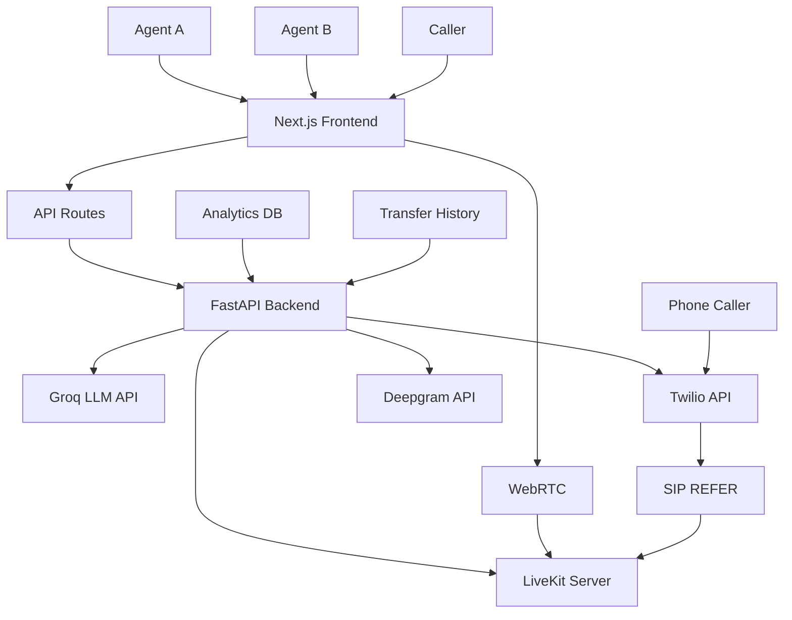

# Warm Transfer Demo Application

A comprehensive demonstration of warm call transfer functionality built with LiveKit, Groq LLM, and Twilio. This application showcases seamless call transfers between agents with AI-powered context sharing, real-time transcription, and advanced analytics.

## 🎯 Features

- **Real-time Communication**: LiveKit-powered video/audio calls with WebRTC
- **AI-Powered Summaries**: Groq LLM generates intelligent call context for transfers
- **Phone Integration**: Twilio enables transfers to real phone numbers with SIP REFER
- **Interactive UI**: Next.js frontend with role-based interfaces for Caller, Agent A, and Agent B
- **Warm Transfer Flow**: Complete agent handoff with context preservation and AI summaries
- **Real-time Transcription**: Deepgram-powered speech-to-text with AI chat responses
- **Analytics Dashboard**: Comprehensive metrics and transfer history tracking
- **WebSocket Notifications**: Real-time updates for transfer events and call status
- **Multi-modal Support**: Support for web calls, phone calls, and hybrid scenarios

## 🏗️ Architecture

The application follows a modern microservices architecture with clear separation of concerns:

### System Architecture Diagram



### Component Overview

- **Backend (Python/FastAPI)**: Core business logic, API endpoints, integrations
- **Frontend (Next.js/TypeScript)**: User interfaces, real-time components, API proxy
- **LiveKit**: Real-time communication platform for audio/video/WebRTC
- **Groq**: Free AI service for generating call summaries and chat responses
- **Twilio**: Telephony service for phone number integration and SIP transfers
- **Deepgram**: Speech-to-text transcription service
- **WebSocket**: Real-time notifications and status updates

## 📋 Prerequisites

- **Python 3.8+** with pip package manager
- **Node.js 18+** with npm package manager
- **LiveKit Account**: Cloud or self-hosted LiveKit server
- **Groq API Key**: Free account at console.groq.com
- **Twilio Account**: For phone integration (optional for web-only demo)
- **Deepgram API Key**: For transcription features (optional)

## 🚀 Setup Instructions

### 1. Clone and Initialize

```bash
git clone <repository-url>
cd warm-transfer-demo
```

### 2. Backend Setup

```bash
cd backend

# Create virtual environment
python -m venv venv
source venv/bin/activate  # On Windows: venv\Scripts\activate

# Install Python dependencies
pip install -r requirements.txt

# Copy environment template
cp env.example .env

# Edit .env with your API keys (see Environment Configuration below)
```

### 3. Frontend Setup

```bash
cd apps/web

# Install Node.js dependencies
npm install

# Copy environment template
cp env.local.example .env.local

# Edit .env.local with your configuration (see Environment Configuration below)
```

### 4. Environment Variable Configuration

#### Backend (.env)
```env
# LiveKit Configuration
LIVEKIT_URL=wss://your-livekit-server.com
LIVEKIT_API_KEY=your_livekit_api_key_here
LIVEKIT_API_SECRET=your_livekit_api_secret_here

# Groq Configuration (Free LLM API)
groq_key=your_groq_api_key_here

# Twilio Configuration (Optional - for phone integration)
TWILIO_ACCOUNT_SID=your_twilio_account_sid_here
TWILIO_AUTH_TOKEN=your_twilio_auth_token_here
TWILIO_PHONE_NUMBER=+1234567890
TWILIO_TARGET_PHONE=+1234567890

# Deepgram Configuration (Optional - for transcription)
DEEPGRAM_API_KEY=your_deepgram_api_key_here

# Webhook Configuration
WEBHOOK_BASE_URL=https://yourdomain.com
```

#### Frontend (.env.local)
```env
# LiveKit Configuration
NEXT_PUBLIC_LIVEKIT_URL=wss://your-livekit-server.com

# Backend API URL
BACKEND_URL=http://localhost:8000
```

### 5. Run the Application

**Terminal 1 - Backend:**
```bash
cd backend
source venv/bin/activate  # On Windows: venv\Scripts\activate
uvicorn main:app --reload --host 0.0.0.0 --port 8000
```

**Terminal 2 - Frontend:**
```bash
cd apps/web
npm run dev
```

**Access Points:**
- **Frontend**: http://localhost:3000
- **Backend API**: http://localhost:8000
- **API Documentation**: http://localhost:8000/docs (FastAPI auto-generated)
- **Alternative Docs**: http://localhost:8000/redoc

## 🎮 Demo Instructions

### Step 1: Role Selection
1. Open http://localhost:3000 in your browser
2. Choose your role: **Caller**, **Agent A**, or **Agent B**
3. Each role has a dedicated interface optimized for their workflow

### Step 2: Initial Call Setup
1. **Caller**: Click "Start Call" to initiate connection to Agent A
2. **Agent A**: Click "Start Taking Calls" to join the system and wait for callers
3. **Agent B**: Click "Connect to Transfer System" to prepare for incoming transfers

### Step 3: Warm Transfer Process
1. **Agent A** receives the caller and engages in conversation
2. **Agent A** clicks "Initiate Warm Transfer" when escalation is needed
3. System automatically:
   - Generates AI-powered call summary using conversation context
   - Creates new transfer room for Agent B
   - Disconnects Agent A from original room
   - Connects Agent A, Agent B, and caller to transfer room
4. **Agent A** reviews the AI-generated summary and provides context to Agent B
5. **Agent A** clicks "Complete Transfer" and exits the room
6. **Agent B** and caller remain connected with full context preserved

### Step 4: Phone Integration (Optional)
- For phone-based transfers, configure Twilio credentials
- The system will initiate calls to Agent B's phone number
- Agent B can join via phone or web interface

### Step 5: Testing Features
- **Transcription**: Speak during calls to see real-time transcription
- **AI Chat**: Use the chat interface for AI-powered responses
- **Analytics**: Visit the analytics page to view transfer metrics
- **Transfer History**: Check completed transfer records

## 📚 API Documentation

### Backend API Endpoints (FastAPI)

#### Core Functionality

| Endpoint | Method | Description | Request Body | Response |
|----------|--------|-------------|--------------|----------|
| `/api/room/create` | POST | Create LiveKit room and generate access token | `CreateRoomRequest` | `CreateRoomResponse` |
| `/api/transfer/initiate` | POST | Initiate warm transfer with AI summary | `TransferInitiateRequest` | `TransferInitiateResponse` |
| `/api/transfer/complete` | POST | Complete transfer and disconnect Agent A | `TransferCompleteRequest` | `TransferCompleteResponse` |

#### Twilio Integration

| Endpoint | Method | Description | Request Body | Response |
|----------|--------|-------------|--------------|----------|
| `/api/twilio/voice` | POST | Twilio webhook for phone call connection | `room_name`, `summary` | TwiML Response |
| `/api/twilio/status` | POST | Handle Twilio call status callbacks | Call status data | Status confirmation |
| `/api/twilio/transfer` | POST | Initiate Twilio phone call for transfer | Transfer details | Call initiation response |
| `/api/twilio/call/{call_sid}` | GET | Get status of specific Twilio call | - | Call details |

#### AI and Communication Features

| Endpoint | Method | Description | Request Body | Response |
|----------|--------|-------------|--------------|----------|
| `/api/chat` | POST | Handle chat messages with AI responses | `ChatRequest` | `ChatResponse` |
| `/api/transcribe` | POST | Transcribe audio and generate AI response | `TranscribeRequest` | `TranscribeResponse` |
| `/api/generate-summary` | POST | Generate AI-powered call summary | Summary request | Summary response |

#### Analytics and History

| Endpoint | Method | Description | Query Params | Response |
|----------|--------|-------------|--------------|----------|
| `/api/analytics` | GET | Get analytics data for dashboard | `time_range` | Analytics data |
| `/api/transfers/history` | GET | Get transfer history for agents | `agent_id`, `limit` | Transfer history |

#### Utility Endpoints

| Endpoint | Method | Description | Request Body | Response |
|----------|--------|-------------|--------------|----------|
| `/api/caller/context` | POST | Get caller context from database | `CallerContextRequest` | `CallerContextResponse` |
| `/api/room/cleanup` | POST | Clean up empty rooms | `room_name` | Cleanup status |
| `/debug/env` | GET | Debug environment variables | - | Environment data |

### Frontend API Routes (Next.js)

All frontend API routes proxy requests to the backend FastAPI server:

| Route | Method | Backend Proxy | Description |
|-------|--------|---------------|-------------|
| `/api/room` | POST | `/api/room/create` | Room creation proxy |
| `/api/transfer` | POST | `/api/transfer/initiate` | Transfer initiation proxy |
| `/api/twilio-transfer` | POST/GET | `/api/twilio/transfer` | Twilio transfer proxy |
| `/api/chat` | POST | `/api/chat` | Chat functionality proxy |
| `/api/transcribe` | POST | `/api/transcribe` | Transcription proxy |
| `/api/generate-summary` | POST | `/api/generate-summary` | Summary generation proxy |

### WebSocket Endpoints

| Endpoint | Purpose | Message Types |
|----------|---------|---------------|
| `/ws/notifications` | Real-time transfer notifications | `transfer_initiated`, `transfer_completed`, `twilio_call_status` |

## 🔧 Technical Details

### LiveKit Integration
- **Real-time Communication**: WebRTC-based audio/video calls
- **Room Management**: Dynamic room creation and participant management
- **Token Authentication**: Secure access tokens for room participation
- **Low-latency Streaming**: Optimized for real-time communication
- **Multi-platform Support**: Web, mobile, and SIP integration

### AI-Powered Features
- **Groq LLM Integration**: Llama-3.1-70b-versatile for intelligent summarization
- **Context-Aware Prompts**: Dynamic prompts based on caller type and conversation history
- **Fallback Handling**: Graceful degradation when AI services are unavailable
- **Conversation Memory**: Maintains chat history for coherent AI responses

### Twilio Integration
- **Programmable Voice API**: Full telephony integration
- **SIP REFER Method**: Standards-compliant call transfers
- **TwiML Responses**: XML-based call control
- **Webhook Handling**: Real-time call event processing
- **Status Callbacks**: Comprehensive call lifecycle tracking

### Frontend Architecture
- **Next.js 14**: App Router with server and client components
- **TypeScript**: Full type safety and IntelliSense support
- **Tailwind CSS**: Utility-first styling with responsive design
- **LiveKit React Components**: Pre-built UI components for real-time features
- **Role-based UI**: Specialized interfaces for different user types
- **Framer Motion**: Smooth animations and transitions

### Backend Architecture
- **FastAPI Framework**: High-performance async API server
- **Pydantic Models**: Data validation and serialization
- **CORS Middleware**: Cross-origin request handling
- **WebSocket Support**: Real-time bidirectional communication
- **Environment Configuration**: Secure credential management
- **Logging**: Comprehensive request/response logging

## 🐛 Troubleshooting Guide

### Common Issues and Solutions

#### LiveKit Connection Problems
**Issue**: "Failed to connect to LiveKit server"
- **Solution**: Verify `LIVEKIT_URL` is correct and accessible
- **Check**: Ensure API key and secret are valid
- **Test**: Confirm LiveKit server is running and reachable

**Issue**: "Room creation failed"
- **Solution**: Check LiveKit server permissions
- **Check**: Verify network connectivity to LiveKit endpoint
- **Test**: Use LiveKit dashboard to test server connectivity

#### AI/LLM Service Issues
**Issue**: "Groq API errors"
- **Solution**: Verify `groq_key` is valid and has quota remaining
- **Check**: Review Groq service status at console.groq.com
- **Fallback**: System continues with basic transfer functionality

**Issue**: "Transcription not working"
- **Solution**: Check Deepgram API key configuration
- **Check**: Verify audio input permissions in browser
- **Test**: Test microphone access and audio levels

#### Twilio Integration Issues
**Issue**: "Phone call not connecting"
- **Solution**: Verify all Twilio credentials are correct
- **Check**: Ensure phone numbers are in E.164 format
- **Test**: Check Twilio dashboard for call logs and errors

**Issue**: "Webhook not receiving events"
- **Solution**: Confirm `WEBHOOK_BASE_URL` is publicly accessible
- **Check**: Verify webhook endpoint is responding correctly
- **Test**: Use Twilio debugger for webhook delivery status

#### Frontend Build/Development Issues
**Issue**: "npm install fails"
- **Solution**: Clear npm cache and node_modules
- **Check**: Verify Node.js version compatibility (18+)
- **Command**: `rm -rf node_modules package-lock.json && npm install`

**Issue**: "Environment variables not loading"
- **Solution**: Ensure `.env.local` is in the correct directory
- **Check**: Restart development server after env changes
- **Test**: Use browser dev tools to verify env vars

#### Backend/Python Issues
**Issue**: "Module not found" errors
- **Solution**: Activate virtual environment: `source venv/bin/activate`
- **Check**: Install all requirements: `pip install -r requirements.txt`
- **Test**: Verify Python version: `python --version`

**Issue**: "Port 8000 already in use"
- **Solution**: Kill existing process or use different port
- **Command**: `lsof -ti:8000 | xargs kill -9`
- **Alternative**: `uvicorn main:app --port 8001`

### Performance Optimization
- **Database**: Implement connection pooling for production
- **Caching**: Add Redis for session and token caching
- **CDN**: Use CDN for static assets in production
- **Monitoring**: Implement application performance monitoring

### Security Considerations
- **API Keys**: Never commit secrets to version control
- **HTTPS**: Always use HTTPS in production
- **CORS**: Configure appropriate CORS policies
- **Rate Limiting**: Implement rate limiting on API endpoints
- **Input Validation**: Validate all user inputs thoroughly

## 📊 Analytics and Monitoring

### Available Metrics
- **Transfer Statistics**: Success rates, duration, failure reasons
- **Call Metrics**: Volume, duration, peak hours, daily patterns
- **Agent Performance**: Individual success rates, handle times
- **Real-time Metrics**: Active calls, queue status, wait times

### Dashboard Features
- **Time Range Filtering**: 1 day, 7 days, 30 days, 90 days
- **Export Capabilities**: CSV/JSON export for reporting
- **Real-time Updates**: Live metrics with WebSocket updates
- **Historical Data**: Transfer history with search and filtering

## 🔄 Development Workflow

### Code Organization
```
├── backend/                 # Python FastAPI backend
│   ├── main.py             # Main application entry point
│   ├── models.py           # Pydantic data models
│   ├── requirements.txt    # Python dependencies
│   └── utils/              # Utility modules
├── apps/web/               # Next.js frontend
│   ├── app/                # Next.js app router
│   ├── components/         # React components
│   └── lib/                # Utility libraries
└── packages/               # Shared packages (ESLint, TypeScript config)
```

### Testing Strategy
- **Unit Tests**: Individual function/component testing
- **Integration Tests**: API endpoint and component integration
- **E2E Tests**: Full user workflow testing
- **Performance Tests**: Load testing for concurrent users

### Deployment Considerations
- **Containerization**: Docker support included
- **Environment Separation**: Development, staging, production configs
- **Scalability**: Horizontal scaling with load balancer
- **Backup**: Database and configuration backups

## 📚 Additional Resources

### Official Documentation
- [LiveKit Documentation](https://docs.livekit.io/) - Real-time communication platform
- [Groq API Reference](https://console.groq.com/docs) - AI/LLM service
- [Twilio Voice API](https://www.twilio.com/docs/voice) - Telephony integration
- [Deepgram API](https://developers.deepgram.com/) - Speech transcription
- [Next.js Documentation](https://nextjs.org/docs) - Frontend framework
- [FastAPI Documentation](https://fastapi.tiangolo.com/) - Backend framework

### Community and Support
- [LiveKit Community](https://github.com/livekit/livekit) - GitHub discussions
- [Twilio Community](https://www.twilio.com/docs/community) - Developer forums
- [Next.js Community](https://nextjs.org/community) - Discord and GitHub

### Related Technologies
- [WebRTC](https://webrtc.org/) - Real-time communication standard
- [SIP Protocol](https://www.ietf.org/rfc/rfc3261.txt) - VoIP signaling
- [TwiML](https://www.twilio.com/docs/voice/twiml) - Twilio markup language

---

**Built with ❤️ for demonstrating modern real-time communication, AI integration, and enterprise-grade call center functionality. Perfect for job applications showcasing full-stack development, real-time systems, and cloud integrations.**